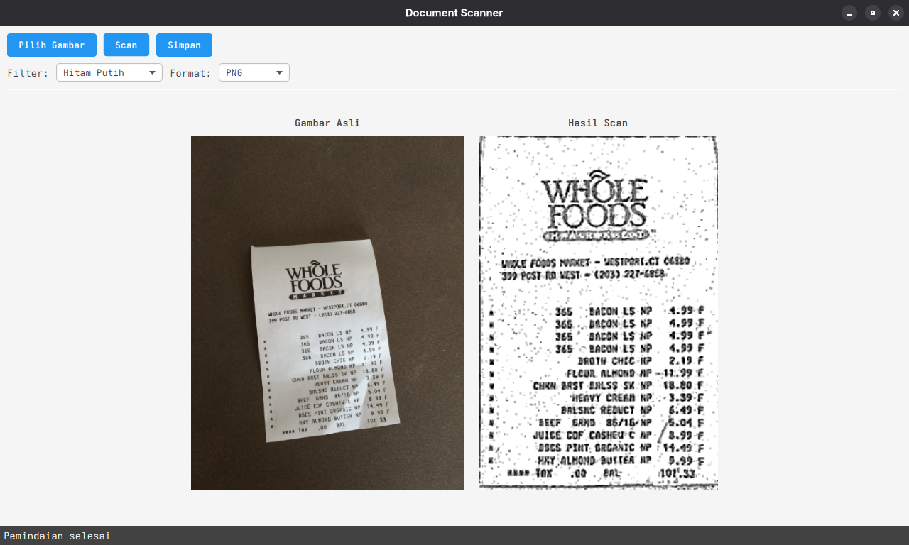

# Document Scanner

Aplikasi Scanner Dokumen berbasis JavaFX yang memungkinkan user untuk scan foto dokumen.



## Fitur
- Unggah gambar dari file lokal
- Deteksi tepi dokumen otomatis
- Koreksi perspektif
- Filter gambar:
  - Grayscale
  - Threshold
  - Real
- Ekspor ke berbagai format:
  - JPEG
  - PNG
  - PDF

## Requirements
- OpenJDK 24
- Maven 3.9.9

## Instalasi

1. Clone repositori:
```bash
git clone https://github.com/riofardinan/scanner-app.git
cd document-scanner
```

2. Build proyek dengan Maven:
```bash
mvn clean install
```

3. Jalankan aplikasi:
```bash
mvn javafx:run
```

## Guide

### Pemindaian Dokumen
1. Klik tombol "Pilih Gambar" untuk memilih file gambar lokal
2. Gunakan tombol "Scan" untuk mendeteksi tepi dokumen dan memperbaiki perspektif
3. Pilih filter lalu klik "Scan"
4. Pilih format ekspor lalu klik "Simpan" untuk menyimpan hasil

### Debug Output
- Debug images disimpan di folder `debug/`
- Format: `[step]_[description].png`

## Struktur Proyek

### Struktur Direktori
```
src/
├── main/
│   ├── java/
│   │   └── com/
│   │       └── scanner/
│   │           ├── app/           # Class utama aplikasi
│   │           ├── controller/    # Controller untuk UI
│   │           ├── processor/     # Processor gambar
│   │           └── export/        # Handler ekspor
│   └── resources/
│       └── com/
│           └── scanner/
│               ├── main.fxml      # Layout UI
│               └── styles.css     # Styling aplikasi
docs/                           # Dokumentasi
```

### Komponen Utama

#### 1. App (`app/`)
- `DocumentScannerApp.java`: Kelas utama aplikasi
  - Inisialisasi JavaFX
  - Konfigurasi awal

#### 2. Controller (`controller/`)
- `ImageController.java`: Controller utama
  - Menangani interaksi UI
  - Mengelola event: upload, proses, simpan

#### 3. Processor (`processor/`)
- `ScannerProcessor.java`: Prosess scan
  - Mengelola alur scanning: deteksi tepi, transformasi, filter, konversi.
- `EdgeDetector.java`: Deteksi tepi
  - Algoritma Canny
  - Hough Transform
  - Contour Detection
- `PerspectiveCorrector.java`: Koreksi perspektif
  - Transformasi homografi
  - Validasi sudut
- `ImageFilter.java`: Filter gambar
  - Grayscale & Threshold

#### 4. Export (`export/`)
- `ExportHandler.java`: Handler ekspor
  - Format PDF/PNG/JPEG

## Lisensi

Proyek ini dilisensikan di bawah MIT License - lihat file LICENSE untuk detail. 